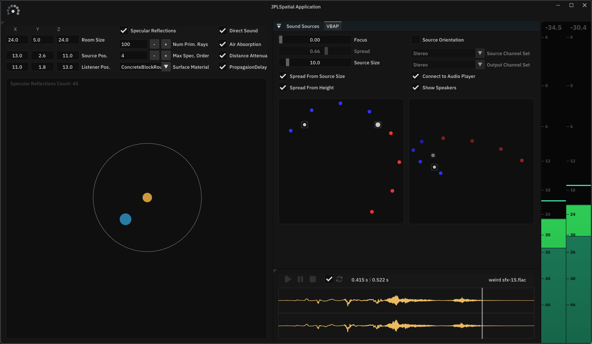

# JPL Spatial Application

Application demonstrating some of the capabilities of [JPL Spatial](https://github.com/Jaytheway/JPLSpatial/).

The GUI is drawn using [Dear ImGui](https://github.com/ocornut/imgui) library with a custom framework on top.

## JPL Spatial Features
- **Direct Sound** (DS) Propagation & Spatialization
- **Ray Traced Early** (*Specular*) **Reflections** (ERs) *(experimental)*
---
- Pannign of **Direct Sound** source is handled by **MDAP** (multiple directions)
- **Early Reflections** are traced using **Image Source** method and panned by **VBAP** (single directoin per ER)
- Propagation delay for both, DS and ERs, is rendered by **Interpolating Delay Lines**
- Propagation filtering (ER *surface absorption*, DS/ER *air absorption*) is processed by **4-band Crossover Filters**
- *Inverse law* distance attenuation is applied to both DS and ERs

## JPL Spatial Application Features
### VBAP/MDAP Visualization

**Direct Sound** source's MDAP has *"all"* the expected parameters exposed to **GUI**:
- **Focus** - contract direction vectors towards source the channel directions
- **Spread** - contract all the direction vectors toward the source pan direction
- **Source Size** - if **Spread From Source Size** is enabeld, the size of the source is used to compute **Spread** based on distance from the listener
- **Spread From Height** - as the source gets closer to *"directly above"* or *"directly below"*, spread minimum value goes towards 1.0 (100%)
- **Source Orientation** - whether to use source orientation for spatialization or not
	- when source orientation **IS used**, the source becomes more like a sound field in the world space
	- when source orientaion is **NOT used**, the source's frame is rotated towards the listener

> [!TIP]
> *Source* and *Output* **Channel Configuration** can be disconnnected form the playing audio to visualize panning for configurations that may not be available on the user's device.

### Sound Source Playback
- **Sound Source** can be selected in the **"Sound Sources"** tab/window
	- a few audio files are available in the repository (and in the release)
	- *sound source directory* can be selected to play different files
- **Audio Player** has waveform view and all the expected playback controlls
- **Loudness Meter** displays *Peak* and *RMS* loundess of the application output; the big number at the top displays current *RMS* value

### Room / Environment Controls

**Room** *(everything is in 3 dimensions)*:
- Room size
- Source position
- Listener position

**Early Reflections** (aka **Specular Reflections**, not that *early* at high order):
- **Max Reflection Order** - maximum allowed reflection order to trace
- **Surface Material** - changes the material absorption applied to reflected ER paths
- **Number of Primary Rays** - mainly needed to balance performace vs source detection possiblility *(for a simple shoe-box room, its 6 surfaces can easily be detected with a small number of rays)*

> [!TIP]
>**Spatialziation Effects** can be enabled/disabled individuslly for the **Direct Sound** to hear the effect with/without them.
>
>**Specular Reflections** and **Directo Sound** can also be muted individually.

## Supported platforms
- Currently Windows only
- Other platforms may or may not work

## Building
- To build the application, run appropriate build script in `build` folder, open generated Visual Studio solution and compile relevant configuration.
- Uses C++20

## Dependencies
- [JPL Spatial](https://github.com/Jaytheway/JPLSpatial/) - sound spatialization and propagaion - ISC license
- [MiniaudioCpp](https://github.com/Jaytheway/JPLSpatial/) - routing and rendering audio to endpoint device - ISC license
- [Walnut (CMake fork)](https://github.com/Jaytheway/WalnutCMake) - platfom window handling and some application utilities - MIT license

## License
The project is distributed under the [ISC license](https://github.com/Jaytheway/JPLSpatialApplication?tab=License-1-ov-file).

### Third-Party Assets
- **JPL Spatial Application** uses [IBM Plex Sans](https://fonts.google.com/specimen/IBM+Plex+Sans) font licensed under the [SIL Open Font License 1.1](licenses/OFL.txt).
  Copyright (c) 2017 IBM Corp. with Reserved Font Name "IBM Plex".
- A few icons are used from [Font Awesome (free)](https://github.com/FortAwesome/Font-Awesome) under the [SIL Open Font License 1.1](licenses/OFL.txt).
  
